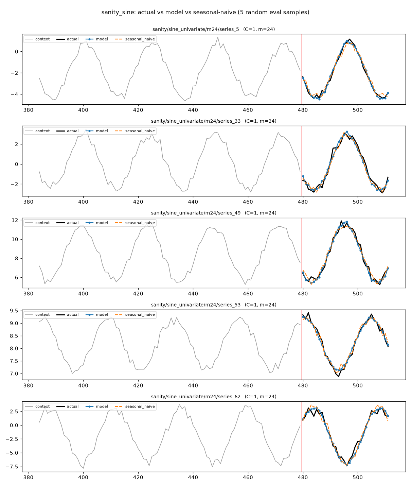
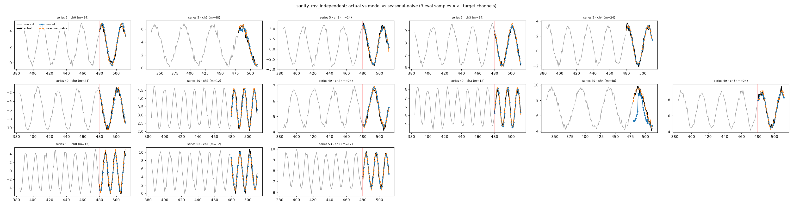
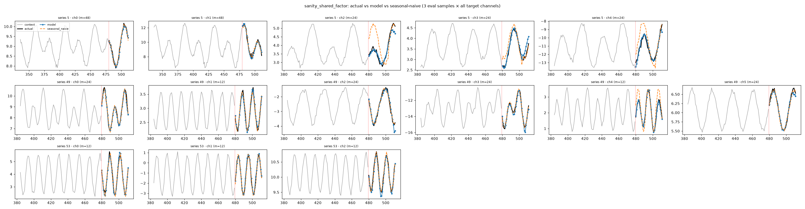
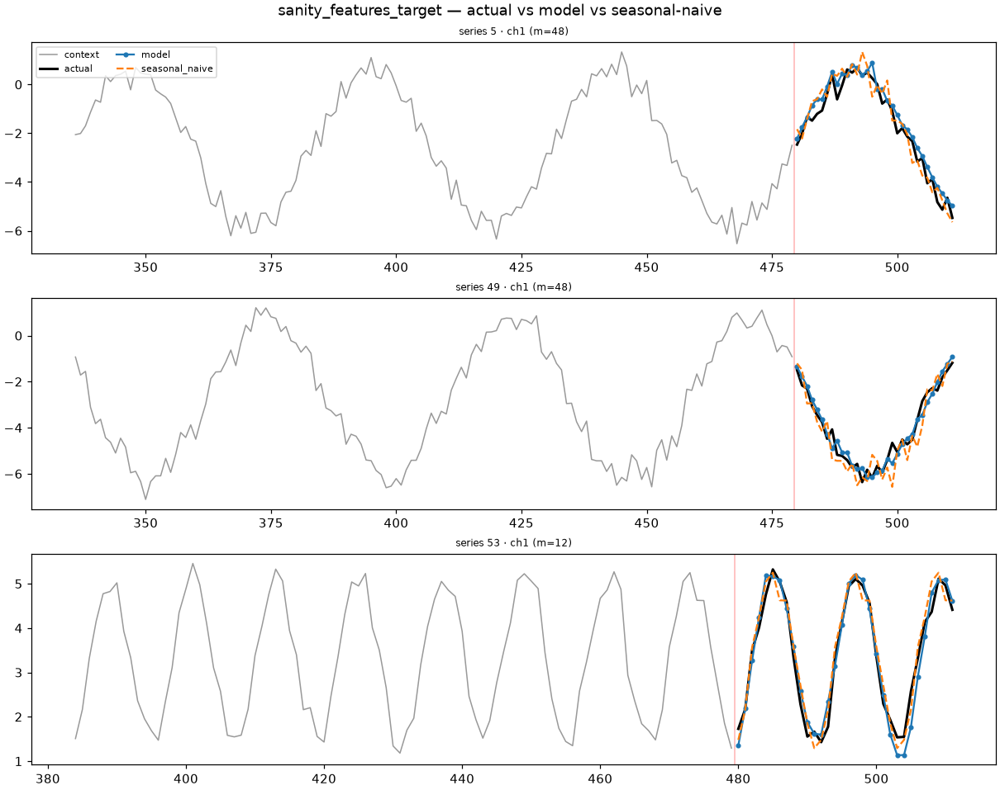
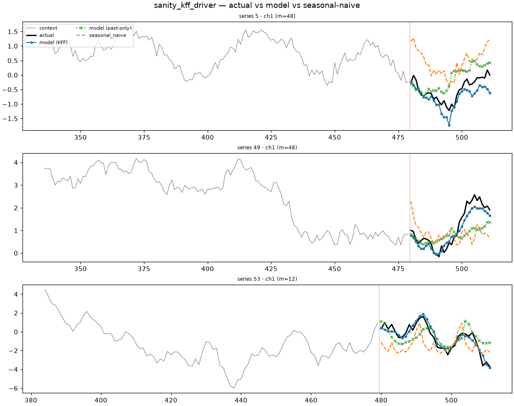
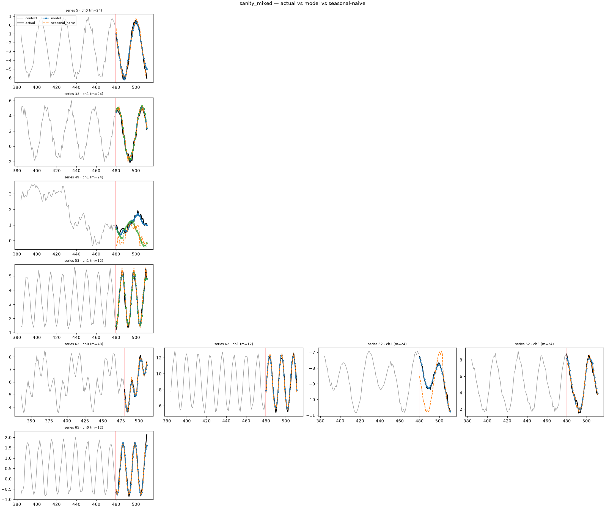

# TETRIS — Sanity Experiments (architecture bring-up)

A running log proving the TETRIS architecture can actually **learn** before we
attempt the zero-shot protocol. Each experiment trains on a small pool of simple
**periodic synthetic** series and forecasts their held-out horizon, scored against
the **seasonal-naive** baseline with **MASE** (GIFT-Eval / gluonts style). The
season length `m` is *dataset metadata* (never detected by the model), exactly as
the GIFT-Eval test split provides it.

**Reading the metric:** `MASE = MAE_horizon / in-sample seasonal-naive denom` in
raw value space. `skill = model_MASE / snaive_MASE`; **skill < 1 ⇒ beats seasonal
naive**. We expect the model to *at least match* naive on clean periodic signals
and to *beat* it where there's learnable structure under the noise.

## Summary

| Case | Model (d/L/H, params) | Device | Steps | Time | model MASE | snaive MASE | skill | Verdict |
|---|---|---|---|---|---|---|---|---|
| [sine_univariate](#sine_univariate) | 64 / 3 / 4, 2.06M | CPU (4 thr) | 1500 | 1m47s | **0.812** | 0.981 | **0.83** | ✅ beats naive |
| [multivariate_independent](#multivariate_independent) | 64 / 3 / 4, 2.06M | CPU (4 thr) | 6000 | 6m31s | **0.895** | 0.994 | **0.90** | ✅ beats naive |
| [shared_factor](#shared_factor) | 64 / 3 / 4, 2.06M | CPU (4 thr) | 6000 | 6m48s | **0.629** | 0.951 | **0.66** | ✅ beats naive |
| [features_target](#features_target) | 64 / 3 / 4, 2.06M | CPU (4 thr) | 6000 | 7m21s | **0.717** | 0.854 | **0.84** | ✅ beats naive |
| [kff_driver](#kff_driver) | 64 / 3 / 4, 2.06M | CPU (4 thr) | 2000 | 2m20s | **0.338** | 1.043 | **0.32** | ✅ KFF needed |
| [mixed (all cases)](#mixed-all-cases) | 64 / 3 / 4, 2.06M | **CUDA RTX 3070, compiled** | 12000 | 25m50s | **0.625** | 0.938 | **0.67** | ✅ beats naive |

For **kff_driver** the headline is the KFF vs past-only contrast (same model): KFF-on
MASE **0.338** vs past-only **0.789** — the known-future covariate cuts error ~57%.

## Planned (v2) — frequency stress test

Once we're comfortable the model learns each case, the **final all-cases run** gets
a *second version* with a **much larger frequency pool** (at least a few hundred
distinct periods, ~continuous, instead of the current small `season_lengths` of
3–4). With only a handful of periods the model can shortcut to "classify which of N
known seasons and pick it", rather than genuinely *inferring* an arbitrary period
from context. The large pool applies across **all** cases (independent, shared
factor, features→target). Not done yet — tracked here so we do it for v2.

## How to reproduce

Env: `uv` + Python 3.13 (see `docs/tetris/workflow.md`). Each run writes a
self-contained, git-ignored `outputs/<run>_<timestamp>/` with `command.txt`,
resolved `config.yaml`, `train_log.txt`, and `samples.png`.

```bash
uv run pytest                                              # expect all green
uv run python -m tetris.train.sanity_run configs/<case>.yaml --steps <N> --eval-every <K>
```

Each case below is a one-line config (`data.case` + `season_lengths`/`n_channels`),
CPU-friendly and identical model size unless noted. Plots referenced here are
copied from the run's `outputs/.../samples.png` (5 random eval samples: context +
actual vs model vs seasonal-naive).

---

## sine_univariate

One clean noisy sine per series, period `m=24` (noise scales with amplitude, so a
model that learns the underlying sine **beats** seasonal-naive, which propagates
the noise from one season ago). The easiest possible signal — the first proof that
the pipeline learns anything at all.

```bash
uv run python -m tetris.train.sanity_run configs/sanity_sine.yaml --steps 1500 --eval-every 500
```

Model: `d_model=64, n_layers=3, n_heads=4, out_patch=8` (2,057,188 params, all
trainable). Device: CPU, 4 threads, torch 2.12.0. 64 series, horizon 32.

| step | train_loss | model MASE | skill |
|---|---|---|---|
| 0 (random) | — | 6.795 | 6.93 |
| 500 | 0.325 | 0.919 | 0.94 |
| 1000 | 0.284 | 0.870 | 0.89 |
| 1500 | 0.249 | **0.812** | **0.83** |

MASE falls from 6.8 (random init) to 0.81, dropping below the seasonal-naive
baseline (0.98) — the model learns the periodic structure and extrapolates it
through the held-out horizon. 1500 steps in 1m47s (~72 ms/step).



---

## multivariate_independent

`C` independent sines (no cross-channel signal). Harder than the sine case in two
deliberate ways: **each channel draws its own frequency per sample** (from
`season_lengths=[12,24,48]`) and **the channel count varies per sample**
(`channels_distribution=[2,6]`). The model must infer each channel's period
independently via its variate id; seasonal-naive is scored per channel with that
channel's true period.

```bash
uv run python -m tetris.train.sanity_run configs/sanity_mv_independent.yaml --steps 6000 --eval-every 1000
```

Same model (2.06M params), CPU. 64 series, 2–6 target channels each (262 channel
scores), horizon 32.

| step | train_loss | model MASE | skill |
|---|---|---|---|
| 0 (random) | — | 7.060 | 7.11 |
| 1000 | 0.374 | 1.282 | 1.29 |
| 2000 | 0.298 | 1.068 | 1.07 |
| 3000 | 0.290 | 0.986 | 0.99 |
| 4000 | 0.264 | 0.918 | 0.92 |
| 6000 | 0.264 | **0.895** | **0.90** |

Crosses below seasonal naive at ~3000 steps and settles at 0.895. The model learns
distinct per-channel frequencies under a varying channel count — variate-id keeps
the channels separate. 6000 steps in 6m31s (~65 ms/step).



---

## shared_factor

`C` channels are random linear combos of a shared bank of sine factors (periods
drawn per sample from `[12,24,48]`; channel count `[2,6]`). Channels that share
factors **correlate** — the D4 cross-channel routing signal. Each channel's
declared seasonality is its dominant factor's period; because each series is a
mixture, single-period seasonal-naive is a weak baseline.

```bash
uv run python -m tetris.train.sanity_run configs/sanity_shared_factor.yaml --steps 6000 --eval-every 1000
```

Same model (2.06M params), CPU. 64 series, 2–6 channels (262 channel scores).

| step | train_loss | model MASE | skill |
|---|---|---|---|
| 0 (random) | — | 5.126 | 5.39 |
| 2000 | 0.305 | 0.830 | 0.87 |
| 4000 | 0.293 | 0.671 | 0.71 |
| 6000 | 0.252 | **0.629** | **0.66** |

The strongest result so far (skill 0.66): the shared periodic structure gives the
model real cross-channel signal to exploit, which a per-channel naive cannot. The
model tracks the mixture closely while seasonal-naive drifts off. 6000 steps in
6m48s.



---

## features_target

A lagged feature drives the target: `target[t] = feature[t-k] + noise`, features-first
`[feature; target]` (nf=1, nt=1), feature period drawn per sample from `[12,24,48]`.
Checks covariate routing (D5/A3) — a channel-independent baseline cannot capture the
lagged edge. The feature future is *not* revealed (past-only covariate), so the model
relies on the feature's observed past plus its learned periodicity to extrapolate.

```bash
uv run python -m tetris.train.sanity_run configs/sanity_features_target.yaml --steps 6000 --eval-every 1500
```

Result: model MASE 4.84 (random) → **0.717**, beating seasonal naive (0.854). The
model routes the lagged covariate into the target forecast. (Plot shows the target
channel only — the feature is an input, not forecast.)



---

## kff_driver

Built to make **known-future features (D11) strictly necessary**:
`target_t = 0.3·periodic_t + 0.7·driver_t`. The **driver** is a dense, aperiodic
known-future covariate (standardized random walk) — *unpredictable from its past* —
and it is 70% of every target step. The periodic part (30%) is past-derivable. So a
model that sees only the feature's **past** structurally cannot predict the target;
it must read the driver's **revealed future** (KFF). Training reveals the driver's
future (`kff_reveal_prob: 1.0`) so the model learns to use it; eval reveals it too
(`known_future_features: true`).

```bash
uv run python -m tetris.train.sanity_run configs/sanity_kff_driver.yaml --steps 2000 --eval-every 1000
```

| eval | model MASE | vs naive (1.043) |
|---|---|---|
| **KFF-on** (future revealed) | **0.338** | skill 0.32 ✅ |
| past-only (future hidden) | 0.789 | — |

The same trained model scores **0.338 with KFF vs 0.789 without** — KFF cuts error
~57%. In the plot the blue **model (KFF)** tracks the random-walk-driven target while
the green **model (past-only)** drifts off and seasonal-naive is far off — a direct,
visual demonstration that the architecture both *needs* and *uses* known-future
covariates. 2000 steps suffices here.



---

## mixed (all cases)

The v1 capstone: **one model learns all five cases at once**. Each series is drawn
round-robin from `{sine_univariate, multivariate_independent, shared_factor,
features_target, kff_driver}` (16 each of 80), with per-sample varying frequencies
`[12,24,48]`, varying channel counts `[2,6]`, and known-future features revealed
(KFF) in training + eval. This is also the first **real CUDA run** — the D14 path:
FlexAttention + `torch.compile` on an RTX 3070 (no shortcuts).

```bash
# on the GPU box (CUDA): flips backend to Flex + torch.compile
uv run python -m tetris.train.sanity_run configs/sanity_mixed.yaml --compile --n-plot 6
```

Result: model MASE 4.70 (random) → **0.625**, beating seasonal naive (0.938),
skill **0.67**, across all five case types simultaneously (183 channel-scores).
12000 steps in 25m50s (7.74 steps/s). The 6-sample plot spans the variety — clean
sines, multivariate, features→target, and the KFF case (blue **model (KFF)** tracks
the random-walk driver while green **model (past-only)** drifts).

Notes (observations + hypotheses, not yet verified):
1. **Mid-train MASE isn't logged under `--compile`** (fact): the eager B=1 eval would
   recompile per item, so we skip it; base/final MASE bracket the run. Fixable by
   marking `R`/`n_var` dynamic in `evaluate_mase`.
2. **GPU slower per step than the Mac CPU here** (observed: 7.74 vs ~14 steps/s).
   *Hypothesis* — at this tiny size (d=64, B=4, L=256) kernel-launch + compile
   overhead likely dominate and the tensors are too small to use the GPU; we expect
   the GPU to win at foundation scale. **Not profiled — a hypothesis.**
3. **Loss plateaus ~step 2.5–3k then oscillates 0.26–0.47** (observed). *Hypothesis*
   — 12k steps is more than this overfit pool needs and the swing is batch-composition
   variance (B=4 mixing different cases/channels/freqs). **Not confirmed as
   over-training — a hypothesis;** could also be LR/optimization noise.


